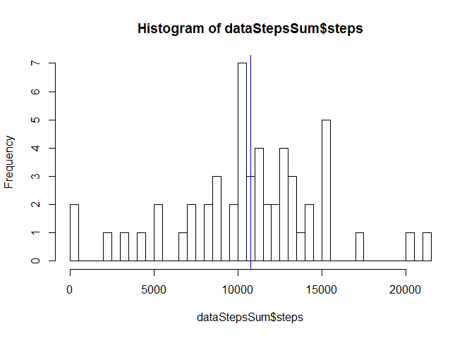
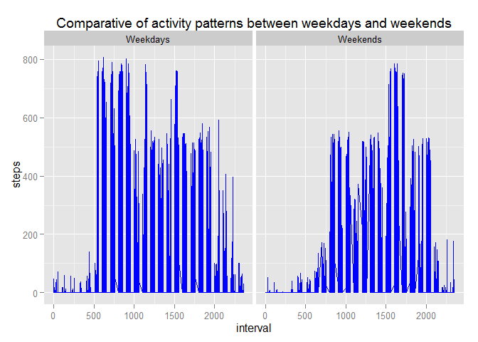
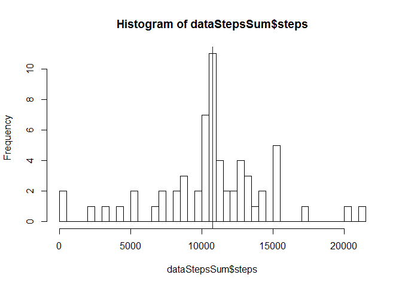

# Reproducible Research: Peer Assessment 1


## Loading and preprocessing the data

```r
#Zip file is always present into project directory
dataZipFile <- "activity.zip"
dataFile <- "activity.csv"

#Check if exists unzipped, else unzip it
if(!file.exists(dataFile)) unzip(dataFile)

#Read file
basedata <- read.csv(dataFile)

#Remove NAs
data <- basedata[!is.na(basedata$steps),]
```


## What is mean total number of steps taken per day?

```r
library(dplyr)
```

```
## 
## Attaching package: 'dplyr'
## 
## The following object is masked from 'package:stats':
## 
##     filter
## 
## The following objects are masked from 'package:base':
## 
##     intersect, setdiff, setequal, union
```

```r
#Calculate Total Steps per day
dataStepsSum <- with(data, aggregate(steps, list(date), sum))
dataStepsSum <- rename(dataStepsSum, date = Group.1, steps = x)
dataStepsSum <- select(dataStepsSum, steps, date)

#Calculate mean and median rounded to 2 decimals
meanSteps <- round(mean(dataStepsSum$steps),2)
medianSteps <- round(median(dataStepsSum$steps),2)
medianSteps
```

```
## [1] 10765
```

```r
#Generate graph
hist(dataStepsSum$steps, breaks = nrow(dataStepsSum))
abline(v = meanSteps, col = "red")
abline(v = medianSteps, col = "blue")
```

 

.      | values
------ | ----------------
mean   | 10766.19
median | 10765


## What is the average daily activity pattern?


```r
library(ggplot2)

dataIntervalAverage <- with(data, aggregate(steps, list(interval), mean))
dataIntervalAverage <- rename(dataIntervalAverage, interval = Group.1, steps = x)
with(dataIntervalAverage, qplot(x = interval, y = steps, geom = "line"))
```

 

```r
maxIntervalAverage <- dataIntervalAverage[dataIntervalAverage$steps == max(dataIntervalAverage$steps),]
```

The maximum average interval of 5-minutes is the interval 835 with an average of 206.17 steps.


## Imputing missing values


```r
#Calculate and report the total number of missing values in the dataset (i.e. the total number of rows with NAs)
naRows <- nrow(basedata[is.na(basedata),])
naRows
```

```
## [1] 2304
```

```r
#Devise a strategy for filling in all of the missing values in the dataset. The strategy does not need to be sophisticated. For example, you could use the mean/median for that day, or the mean for that 5-minute interval, etc.
```

I'm going to use the mean for that 5-minute interval with na value for steps


```r
#Create a new dataset that is equal to the original dataset but with the missing data filled in.

dataToTreat <- basedata

dataToTreat %>% 
inner_join(dataIntervalAverage, by = "interval") %>%
mutate(steps = ifelse(is.na(steps.x), steps.y, steps.x)) %>%
select(steps, date, interval) -> dataTreated

#Make a histogram of the total number of steps taken each day and Calculate and report the mean and median total number of steps taken per day. Do these values differ from the estimates from the first part of the assignment? What is the impact of imputing missing data on the estimates of the total daily number of steps?

#Calculate Total Steps per day
dataStepsSum <- with(dataTreated, aggregate(steps, list(date), sum))
dataStepsSum <- rename(dataStepsSum, date = Group.1, steps = x)
dataStepsSum <- select(dataStepsSum, steps, date)

#Calculate mean and median rounded to 2 decimals
meanStepsTreated <- round(mean(dataStepsSum$steps),2)
medianStepsTreated <- round(median(dataStepsSum$steps),2)
medianStepsTreated
```

```
## [1] 10766.19
```

```r
#Generate graph
hist(dataStepsSum$steps, breaks = nrow(dataStepsSum))
abline(v = meanStepsTreated, col = "red")
abline(v = medianStepsTreated, col = "blue")
```

 

values | data with NA    | data without NA
------ | --------------- | ---------------
mean   | 10766.19   | 10766.19
median | 10765 | 10766.19

## Are there differences in activity patterns between weekdays and weekends?

 

