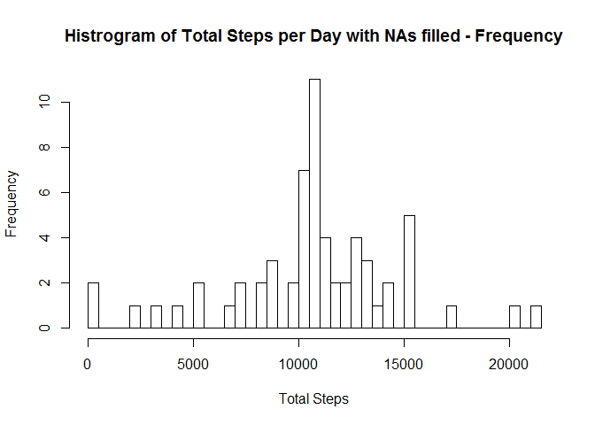

# Reproducible Research: Peer Assessment 1
by jmvilaverde  


## 1. Loading and preprocessing the data

#### Code:

```r
##Load the data
#Zip file is always present into project directory
dataZipFile <- "activity.zip"
dataFile <- "activity.csv"

#Check if exists unzipped, else unzip it
if(!file.exists(dataFile)) unzip(dataFile)

#Read file
basedata <- read.csv(dataFile, sep = ",")

##Process data
#Remove NAs
data <- basedata[!is.na(basedata$steps),]
```

***

## 2. What is mean total number of steps taken per day?

### Calculate total number of steps taken per day

#### Code:


```r
#Use of dplyr library
library(dplyr)
```

```
## 
## Attaching package: 'dplyr'
## 
## The following object is masked from 'package:stats':
## 
##     filter
## 
## The following objects are masked from 'package:base':
## 
##     intersect, setdiff, setequal, union
```

```r
#Calculate Total Steps per day
#Use dataset data without NAs
dataStepsSum <- with(data, aggregate(steps, list(date), sum))
dataStepsSum <- rename(dataStepsSum, date = Group.1, steps = x)
dataStepsSum <- select(dataStepsSum, steps, date)
```

### Histogram of the total number of steps taken each day

#### Code:


```r
#Generate graph
hist(dataStepsSum$steps, breaks = nrow(dataStepsSum), main = "Histrogram of Total number of Steps per Day", xlab = "Total Steps")
```

 


### Calculate and report the mean and median of the total number of steps taken per day

#### Code:


```r
#Calculate mean and median rounded to 2 decimals
meanSteps <- round(mean(dataStepsSum$steps),2)
medianSteps <- round(median(dataStepsSum$steps),2)
```

> Values of mean and median for data without NAs
> 
.      | values
------ | -----------------------------
mean   | 10766.19
median | 10765

***

## 3. What is the average daily activity pattern?

### Make a time series plot of the 5-minute interval (x-axis) and the average number of steps taken, averaged across all days (y-axis)

#### Code:


```r
#Use ggplot2 library
library(ggplot2)

#Calculate average number of steps per 5-minute interval
dataIntervalAverage <- with(data, aggregate(steps, list(interval), mean))
dataIntervalAverage <- rename(dataIntervalAverage, interval = Group.1, steps = x)

#Make plot
with(dataIntervalAverage, qplot(x = interval, y = steps, geom = "line", main = "Average of steps taken by 5-minute interval", xlab = "5-minute interval", ylab = "Average steps"))
```

 

### Calculate 5-minute interval that contains the maximum number of steps on average across all the days.

#### Code:


```r
#Calculate maximum number of steps interval
maxIntervalAverage <- dataIntervalAverage[dataIntervalAverage$steps == max(dataIntervalAverage$steps),]
```

> The maximum average interval of 5-minutes interval is 835 with an average of 206.17 steps.

***

## 4. Imputing missing values

### Calculate and report the total number of missing values in the dataset

#### Code:


```r
#Calculate total number of missing values
naRows <- nrow(basedata[is.na(basedata),])
```

> Total number of rows with missing values is 2304

### Devise a strategy for filling in all of the missing values in the dataset. 

> As strategy for filling in all of the missin values I'm going to use the mean of steps for that 5-minute interval.


### Create a new dataset that is equal to the original dataset but with the missing data filled in.

#### Code:


```r
#Create a new dataset that is equal to the original dataset but with the missing data filled in.
#Is used dataset basedata, this dataset is the original that contains NAs.
#The NAs values are replaced with the mean of this interval contained in dataset dataIntervalAverage

basedata %>% 
inner_join(dataIntervalAverage, by = "interval") %>%
mutate(steps = ifelse(is.na(steps.x), steps.y, steps.x)) %>%
select(steps, date, interval) -> dataTreated

#Calculate Total Steps per day
dataStepsSumTreated <- with(dataTreated, aggregate(steps, list(date), sum))
dataStepsSumTreated <- rename(dataStepsSumTreated, date = Group.1, steps = x)
dataStepsSumTreated <- select(dataStepsSumTreated, steps, date)
```

### Make a histogram of the total number of steps taken each day and Calculate and report the mean and median total number of steps taken per day. 

#### Code:


```r
#Generate histogram
hist(dataStepsSumTreated$steps, breaks = nrow(dataStepsSumTreated), main = "Histrogram of Total Steps per Day with NAs filled - Frequency", xlab = "Total Steps")
```

 

#### Code:


```r
#Calculate mean and median rounded to 2 decimals
meanStepsTreated <- round(mean(dataStepsSumTreated$steps),2)
medianStepsTreated <- round(median(dataStepsSumTreated$steps),2)
```

> Comparative of mean and median for data with and without NAs
> 
values | data with NA                  | data without NA                      | difference
------ | ----------------------------- | ------------------------------------ | ------------------------------------------------
mean   | 10766.19   | 10766.19   | 0
median | 10765 | 10766.19 | -1.19000000000051

#### Do these values differ from the estimates from the first part of the assignment? 

> Yes, it differ from the estimates.

#### What is the impact of imputing missing data on the estimates of the total daily number of steps?

> The mean remains the same, but the median is bigger without missing data.

***

## 5. Are there differences in activity patterns between weekdays and weekends?

### Create a new factor variable in the dataset with two levels – “weekday” and “weekend” indicating whether a given date is a weekday or weekend day.

#### Code:


```r
library(lubridate)

getTypeOfDay <- function(x) {ifelse(x %in% c(7,1),"Weekends", "Weekdays")}

data %>%
        mutate(wdays = wday(ymd(date))) %>% 
        mutate(typeOfDay = as.factor(getTypeOfDay(wdays))) %>%
        select(steps, date, interval, typeOfDay) -> dataDays

dataDaysAverage <- with(dataDays, aggregate(steps, list(interval, typeOfDay), mean))
dataDaysAverage <- rename(dataDaysAverage, interval = Group.1, typeOfDay = Group.2, steps = x)
```

### Make a panel plot containing a time series plot of the 5-minute interval (x-axis) and the average number of steps taken, averaged across all weekday days or weekend days (y-axis).

#### Code:


```r
g <- ggplot(dataDaysAverage, aes(interval, steps)) 
g <- g + geom_line(col="blue") + facet_wrap(~typeOfDay)
g <- g + ggtitle("Comparative of activity patterns between weekdays and weekends")
g <- g + xlab("5-minute interval") + ylab("Total steps")
g
```

 

