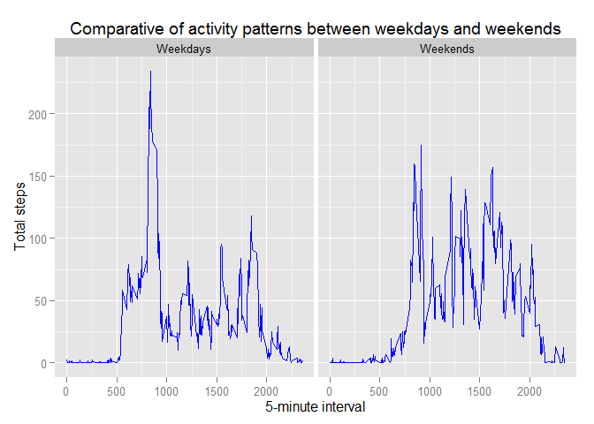

# Reproducible Research: Peer Assessment 1
jmvilaverde  


## Loading and preprocessing the data


```r
##Assessment requirements
#Show any code that is needed to
#Load the data (i.e. read.csv())
#Process/transform the data (if necessary) into a format suitable for your analysis
##Assessment requirements
```


```r
##Load the data
#Zip file is always present into project directory
dataZipFile <- "activity.zip"
dataFile <- "activity.csv"

#Check if exists unzipped, else unzip it
if(!file.exists(dataFile)) unzip(dataFile)

#Read file
basedata <- read.csv(dataFile, sep = ",")

##Process data
#Remove NAs
data <- basedata[!is.na(basedata$steps),]
```


## What is mean total number of steps taken per day?

```r
##Assessment requirements
#For this part of the assignment, you can ignore the missing values in the dataset.
#Calculate the total number of steps taken per day
#If you do not understand the difference between a histogram and a barplot, research the difference between them. 
#Make a histogram of the total number of steps taken each day
#Calculate and report the mean and median of the total number of steps taken per day
##Assessment requirements
```


```r
#Use of dplyr library
library(dplyr)
```

```
## 
## Attaching package: 'dplyr'
## 
## The following object is masked from 'package:stats':
## 
##     filter
## 
## The following objects are masked from 'package:base':
## 
##     intersect, setdiff, setequal, union
```

```r
#Calculate Total Steps per day
dataStepsSum <- with(data, aggregate(steps, list(date), sum))
dataStepsSum <- rename(dataStepsSum, date = Group.1, steps = x)
dataStepsSum <- select(dataStepsSum, steps, date)
```


```r
#Generate graph
hist(dataStepsSum$steps, breaks = nrow(dataStepsSum), main = "Histrogram of Total Steps per Day - Frequency", xlab = "Total Steps")
```

 


```r
#Calculate mean and median rounded to 2 decimals
meanSteps <- round(mean(dataStepsSum$steps),2)
medianSteps <- round(median(dataStepsSum$steps),2)
```

Values of mean and median for data without NAs

.      | values
------ | -----------------------------
mean   | 10766.19
median | 10765


## What is the average daily activity pattern?


```r
#Make a time series plot (i.e. type = "l") of the 5-minute interval (x-axis) and the average number of steps taken, averaged across all days (y-axis)
#Which 5-minute interval, on average across all the days in the dataset, contains the maximum number of steps?
```


```r
#Use ggplot2 library
library(ggplot2)

#Calculate average numerber of steps per 5-minute interval
dataIntervalAverage <- with(data, aggregate(steps, list(interval), mean))
dataIntervalAverage <- rename(dataIntervalAverage, interval = Group.1, steps = x)

#Make plot
with(dataIntervalAverage, qplot(x = interval, y = steps, geom = "line", main = "Average of steps taken by 5-minute interval", xlab = "5-minute interval", ylab = "Average steps"))
```

 


```r
#Calculate maximum number of steps interval
maxIntervalAverage <- dataIntervalAverage[dataIntervalAverage$steps == max(dataIntervalAverage$steps),]
```

The maximum average interval of 5-minutes interval is 835 with an average of 206.17 steps.


## Imputing missing values


```r
#Note that there are a number of days/intervals where there are missing values (coded as NA). The presence of missing days may introduce bias into some calculations or summaries of the data.
#Calculate and report the total number of missing values in the dataset (i.e. the total number of rows with NAs)
#Devise a strategy for filling in all of the missing values in the dataset. The strategy does not need to be sophisticated. For example, you could use the mean/median for that day, or the mean for that 5-minute interval, etc.
#Create a new dataset that is equal to the original dataset but with the missing data filled in.
#Make a histogram of the total number of steps taken each day and Calculate and report the mean and median total number of steps taken per day. Do these values differ from the estimates from the first part of the assignment? What is the impact of imputing missing data on the estimates of the total daily number of steps?
```


```r
#Calculate total number of missing values
naRows <- nrow(basedata[is.na(basedata),])
```

Total number of rows with missing values is 2304

As strategy for filling in all of the missin values I'm going to use the mean of steps for that 5-minute interval.


```r
#Create a new dataset that is equal to the original dataset but with the missing data filled in.

dataToTreat <- basedata

dataToTreat %>% 
inner_join(dataIntervalAverage, by = "interval") %>%
mutate(steps = ifelse(is.na(steps.x), steps.y, steps.x)) %>%
select(steps, date, interval) -> dataTreated

#Calculate Total Steps per day
dataStepsSum <- with(dataTreated, aggregate(steps, list(date), sum))
dataStepsSum <- rename(dataStepsSum, date = Group.1, steps = x)
dataStepsSum <- select(dataStepsSum, steps, date)
```


```r
#Make a histogram of the total number of steps taken each day and Calculate and report the mean and median total number of steps taken per day. Do these values differ from the estimates from the first part of the assignment? What is the impact of imputing missing data on the estimates of the total daily number of steps?

#Generate graph
hist(dataStepsSum$steps, breaks = nrow(dataStepsSum))
```

 


```r
#Calculate mean and median rounded to 2 decimals
meanStepsTreated <- round(mean(dataStepsSum$steps),2)
medianStepsTreated <- round(median(dataStepsSum$steps),2)
```

values | data with NA                  | data without NA                      | difference
------ | ----------------------------- | ------------------------------------ | ------------------------------------------------
mean   | 10766.19   | 10766.19   | 0
median | 10765 | 10766.19 | -1.19000000000051

## Are there differences in activity patterns between weekdays and weekends?


 

